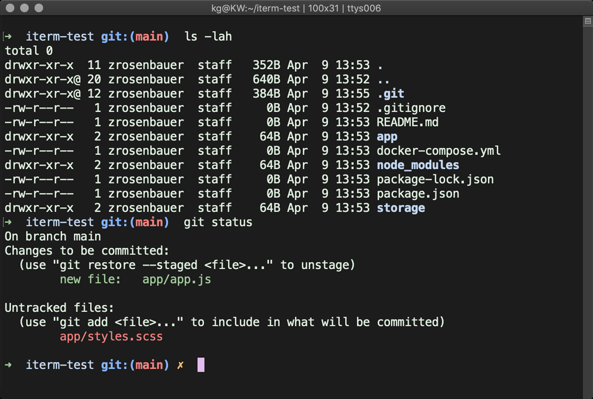
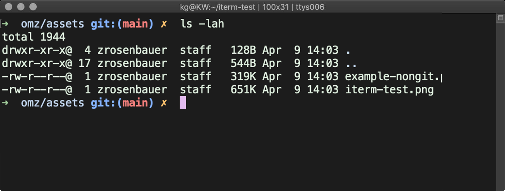
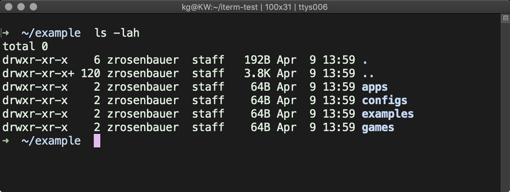

# `zrosenbauer.zsh-theme`

My `oh-my-zsh` theme, based on [robbyrussell](https://github.com/ohmyzsh/ohmyzsh/blob/master/themes/robbyrussell.zsh-theme).



## Installation

### 1. Clone the repository

```bash
# $CODE is where ever you keep your code (or change to `~/code` if you prefer)
git clone https://github.com/zrosenbauer/zrosenbauer.zsh-theme.git ~/$CODE/zrosenbauer
```

### 2. Copy the theme to your `~/.oh-my-zsh/themes` directory

```bash
cd ~/$CODE/zrosenbauer
yarn copy # you can also run `node copy.mjs` if you don't have yarn installed
```

### 2. Set the theme in your `~/.zshrc`

```bash
vim ~/.zshrc
```

Add the following line to the file:

```bash
ZSH_THEME="zrosenbauer" # you might need to replace the existing line
```

## Why

I love the look of the `robbyrussell` theme, but I got tired of trying to figure out which `packages` directory I was in. So I tweaked it to show the current directory instead, relative to the root of the git repo.

#### Relative to git root



#### Relative to home



